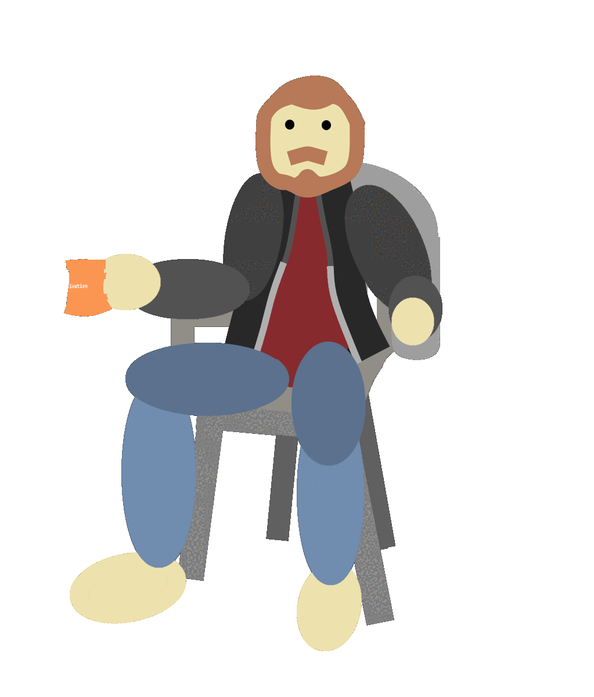

  

 
 

### : 

 
 

 

 
 

### : Studies 📖
- I really like the developer community and I have a lot of fun learning new things about my profession, I'm always reading a book or taking a course on something related to development.
- 
 

### : Fun Fact 🎲
- My two favorite things to have fun are playing Touhou and Tabletop rpgs
- 
 

### : Fun Fact 📫
- hmigotto@gmail.com
